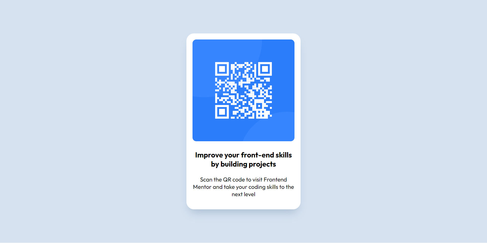

# QR code component solution

This is a solution to the [QR code component challenge on Frontend Mentor](https://www.frontendmentor.io/challenges/qr-code-component-iux_sIO_H). Frontend Mentor challenges help you improve your coding skills by building realistic projects.

## Table of contents

- [Overview](#overview)
  - [Screenshot](#screenshot)
  - [Links](#links)
  - [Built with](#built-with)
  - [What I learned](#what-i-learned)
  - [Continued development](#continued-development)
- [Author](#author)

## Overview

-QR code component challenge

### Screenshot



### Links

- Solution URL: [Add solution URL here](https://your-solution-url.com)
- Live Site URL: [Add live site URL here](https://your-live-site-url.com)

### Built with

- Semantic HTML5 markup
- CSS custom properties
- Google fonts

### What I learned

With this challenge i have learnt how to use margins to center my component, and also how use max-width property to perfectly size my component.

```css
.content {
  --radius: 1.25rem;

  width: 100%;
  height: auto;
  padding: 1rem;
  border-radius: var(--radius);
  max-width: 280px;
  background: var(--clr-white);
  margin-inline: auto;
  box-shadow: 0 1rem 1.5rem -0.5rem rgba(0 50 100 / 0.2);
}
```

### Continued development

- I am learning to how to set margins, max-width, min-width, padding to perfectly design components.
- Responsive design and use of media querries.
- Using Flex box.
- Using Grid.

## Author

- Netlify - [Patrick Odida](https://app.netlify.com/teams/podida67/overview)
- Frontend Mentor - [@patrickodida](https://www.frontendmentor.io/profile/Patrickodida)
- Linkedin - [Patrick Odida] (https://www.linkedin.com/in/patrick-odida-20b882212)
